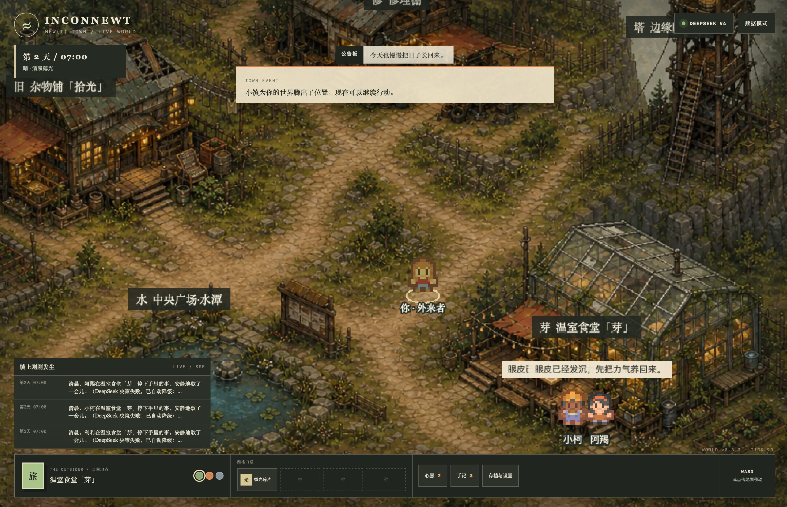

<h3 align="center">走进一座劫后重生的小镇，和四位居民一起生活。</h3>

<p align="center">

</p>
<p align="center">
  
  
  
  
  
  
  <a href="https://github.com/Moyuin-aka/Inconewt/blob/main/LICENSE"></a>
</p>

---

## 这是什么？

**新螈镇 (Incon newt)** 是一个在浏览器里运行的 AI 小镇。你扮演一位「外来者」，走进一座经历过灾变的小镇——这里有杂物铺、温室食堂、瞭望塔……还有四位有自己性格、日程和记忆的居民。

他们会自己起床、吃饭、工作、闲逛，彼此聊天，也会和你交流。你用自然语言跟他们说话，他们听得懂。

<br>

<p align="center">
  
</p>

---

## 你能做什么

| | |
|---|---|
| **探索小镇** | 用键盘 WASD 或鼠标点击在七个地点之间移动 |
| **和居民对话** | 走近任何居民，用你自己的话跟他们聊——拜托、暗示甚至开玩笑都行 |
| **拜托居民做事** | 「帮我告诉阿羯今晚风大」「去陪利利吃个饭吧」——他们会判断要不要听你的 |
| **收集物品** | 场景里散落着可拾取的旧物，四格口袋放得下你的发现 |
| **完成心愿** | 居民有各自的心愿，帮他们达成可以加深关系、解锁秘闻 |
| **影响天气** | 到水潭边许愿，可以让小镇放晴或起雾 |
| **在公告板留言** | 写下任何话，四位居民会各自做出不同反应 |
| **解锁小镇秘密** | 随着好感提升，居民会渐渐向你透露关于这座小镇的往事 |

---

## 小镇里的居民

四位居民都有独立的人设、日程表和记忆系统。他们不是等着你点击的 NPC——即使你什么都不做，他们也在过自己的生活。

---

## 开始游玩

只需要一台装了 [Docker](https://www.docker.com/get-started/) 的电脑。

**方式一：一键启动（推荐）**
下载项目到仓库，然后
```bash
docker compose up --build
```

打开浏览器访问 **http://localhost:8080**，你的小镇之旅就开始了。

**方式二：使用云端镜像**

如果不想本地构建，可以直接拉取预构建的镜像：

```bash
docker compose -f docker-compose.ghcr.yml up -d
```

> 停止小镇：`docker compose down`

---

## 接入 AI（可选）

默认情况下小镇以离线模式运行，所有居民的行为由内置规则驱动。
想让居民的对话和决策更自然、更有个性？接入 DeepSeek 或任意 OpenAI 兼容格式即可。

```bash
cp .env.example .env
```

编辑 `.env` 文件，填入你的密钥：

```dotenv
AI_PROVIDER=deepseek
DEEPSEEK_API_KEY=你的密钥
```

> AI 调用出错时会自动切回离线模式，不会影响游玩。

---

## 你的世界，你的存档

- **每位访客拥有独立的小镇世界**——即使多人同时访问同一个地址，彼此的世界互不干扰
- **关闭页面后小镇会冻结**——回来时从离开的地方继续，不会错过任何事
- **3 个手动存档 + 自动存档**——随时保存、随时恢复
- **支持导出/导入**——换电脑、清浏览器都不怕，下载 JSON 存档即可迁移

---

## 常见问题

**需要什么配置？**
能运行 Docker 的电脑、服务器都行。小镇本身很轻量。

**必须有 AI 密钥吗？**
没有 AI 密钥也能完整体验——小镇内置了离线模式。
接入 AI 后，居民会变得更聪明、更有个性。


**存档丢了怎么办？**
在「存档与设置」面板里可以导出 JSON 文件。只要保留了这份文件，随时可以在新设备上导入恢复。

**可以部署到服务器给朋友玩吗？**
可以。每位访客会自动获得独立的世界实例，互不干扰。服务器会自动管理活跃世界数量和 AI 调用额度。

---

<p align="center">
  角色精灵改编自 <a href="https://kenney.nl/assets/rpg-urban-pack">Kenney RPG Urban Pack</a>（CC0）
</p>
