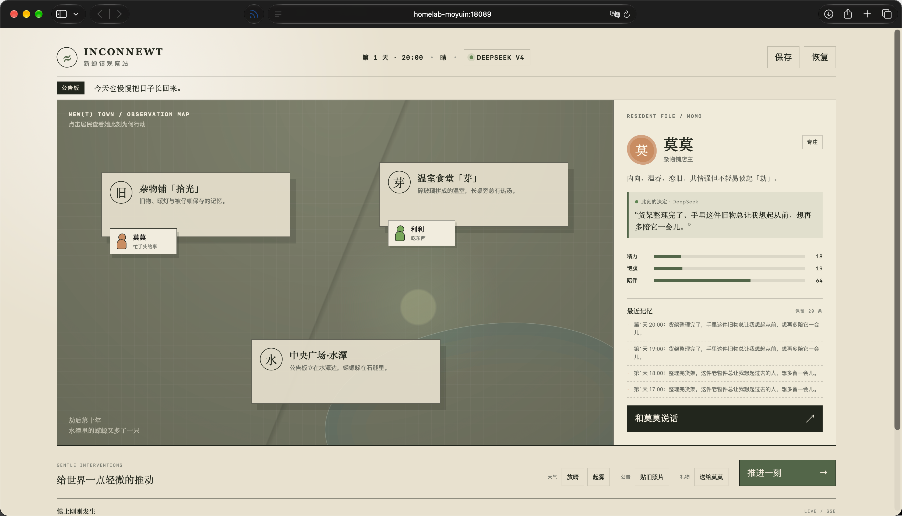
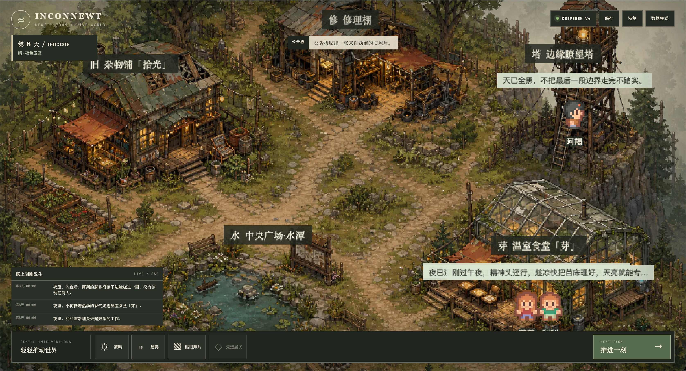

提示词：
第一轮 claude-fable-5:
 > 请你查看 goal.md，探索适合的一种技术栈。你可以参考之前2025年腾讯一场比赛里来自港科大团队设计的 AI+Civilization 作品 「Aivilization」，做一个要求的基础架构与设计的文档和「基础设计」的Todo list，写在 goal.md 的下方，不要改动原始要求。技术栈包括：前端web平台技术栈，美术表现形式，后端AI交互设计语言，数据库选择，部署方式选择（我有服务器可部署），其他AI应用细节选择（如NPC数据结构设计、交互设计）。
-> goal.md

个性化小需求：
>  我有一个关于个性化小需求，这个游戏我命名为 Inconnewt，主要就是为了我过去写过的一个设定集「inconewt」服务。背景发生于一个劫后小镇的故事，主要有：莫莫，小柯，阿羯，利利等不同NPC。性格迥异，对应的agent提示词约束生成也会很多，想要更拆分的去分配NPC实践。我们需不需要为了一点点个性化的需求，做一个真正的有世界观的游戏呢？那动笔前我们要写好一个剧情大纲，你可以再创建一个剧情大纲文件 outline.md，方便美术与NPC个性化的约束。
-> outline.md 手动修改。

demo 搭建 GPT-5.6 sol high：
> /goal 配合 goal.md 和 outline.md，搭建一个初始demo。要求：1.在遵循要求文件的同时，demo环节不要做太多测试，不考虑太多性能优化环节、美术效果，先跑起来再说。2.基础性安全问题要保证，例如不暴露 api key 的底线。 3.友好原则：部署友好，代码编辑友好，查看友好。如：功能有中文注释，但要过于保守型编程（例如为了一个函数就创建一个文件，只放这个函数的代码），每个功能需要有关联性集合于文件，便于阅读查阅，适合code review。 4.功能版本管理，发现不对劲就进行版本迭代，项目 github 地址：https://github.com/Moyuin-aka/Inconewt.git 5.需要接入AI api key，技术选择deepseek v4 flash，处理好demo好告知填写，测试兜底刚好用mock数据。 好了交给你了去做吧～

初级版本demo：

优化方案 fable:
> 我让其他agent做了一个demo。现在有一个问题，这不像是「游戏」，而是文字的某种对话框。反正让人看起来就不像是「游戏」，没有那种游戏的横版交互啊之类的，我在想可以参考很多游戏（比如明日方舟）的交互设计。自主决策也显得比较单薄。请你再设计一个优化的方向prompt，更新一下goal.md的需求
-> 更新了goal.md

优化后，继续让fable梳理要求，GPT生图，完成构建游戏。得到v2版本。

之后提升玩法性，fable
>  v2.1 完成了，你再帮我审查一下效果和性能～现在更多的是完善了，现在场景地点较少，然后的话玩家与NPC的互动似乎并不是非常有用。如果玩家也是里面的一员，可以通过与NPC的对话、对天气的修改等来交互就好了。v3主要是提升「可玩性」